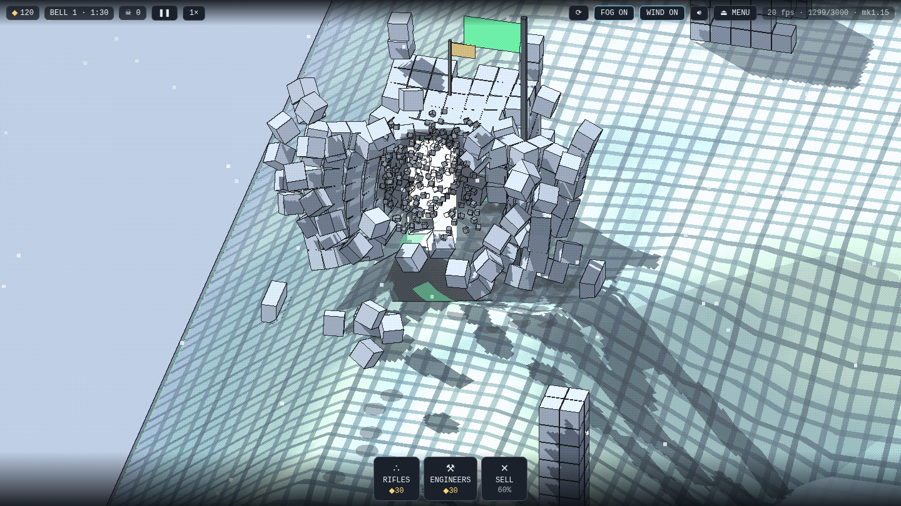
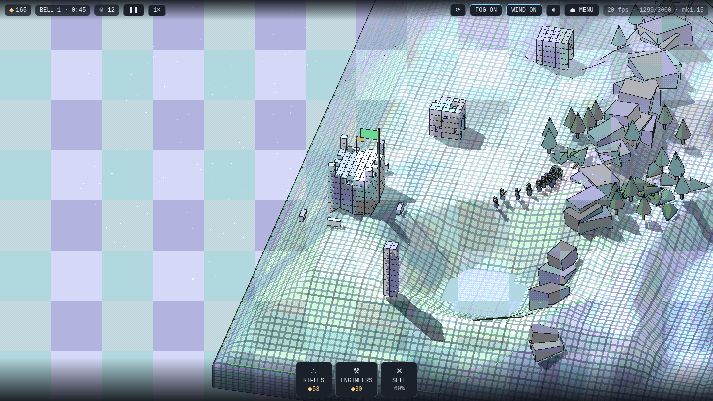
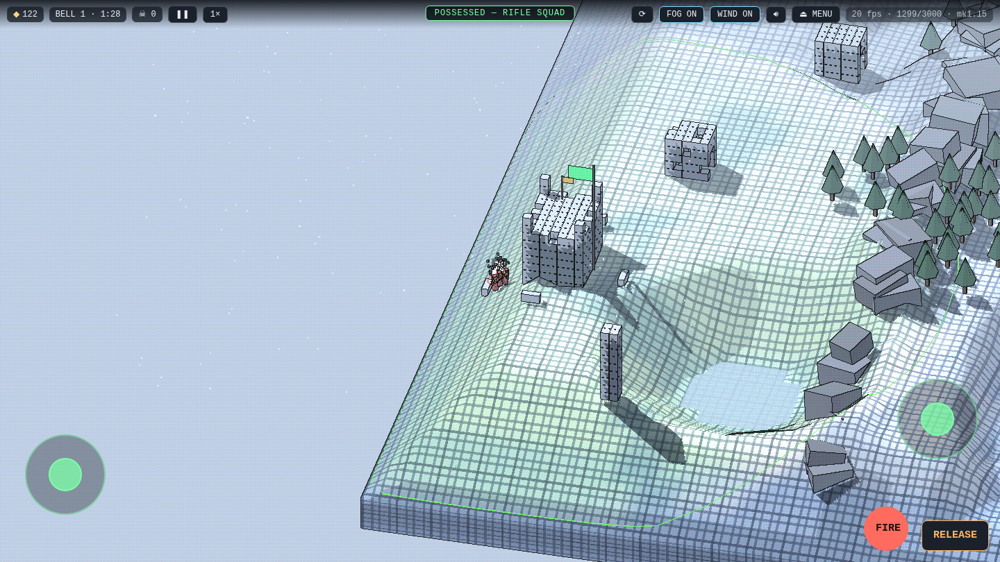
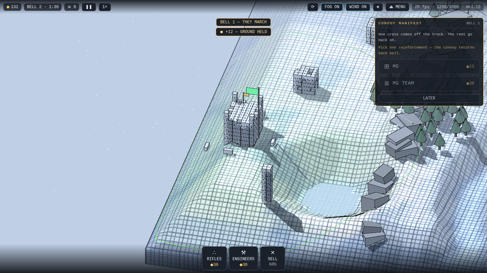

# COLDSNAP — WINTER FRONT

**A full physics war game that fits on a floppy disk.** 💾

The whole thing — the war, the engine, five tech demos, every sound — is one 1.25 MB bundle, about 395 KB over the wire.

**PLAY:** https://jeffreycoen.github.io/coldsnap/

| | |
|---|---|
|  |  |
|  |  |

Destruction here is structural, not scripted. Every building is individual stones held together by welds with real break forces — a collapse is the physics finding out, not an animation playing.

- **The physics engine is written from scratch in plain JavaScript.** No game engine, no physics library, no WebAssembly. Three.js pushes the triangles; React draws the menus.
- **Deterministic to the bit.** No hidden randomness anywhere. Same seed, same valley; same actions, same war — provable by hash, and tested that way on every push.
- **Every valley is drawn fresh.** Hills, a stream with one crossing, villages, forests — no two wars share ground. `?seed=` replays a specific one.
- **The enemy lives under your rules.** Same physics, same shared market, same prices, same purchase pacing. Symmetry is law.
- **Sight is honest.** Walls block sight and never grant it. An enemy no one sees is not drawn at all.
- **Every sound is synthesized.** Zero audio files: gunfire, the bell, the wind — all procedural, tuned against published acoustics. Distant fire arrives late — sound travels at 343 m/s in-game — and echoes off rock and masonry while the snowfield stays dead.
- **A whole war saves as one JSON string.** The map is not saved — it regrows from its seed, and the war's scars are laid back over it. Lose your depot and the save burns. No rewinds.
- **60 fps on a Raspberry Pi.** The game was built, measured, and played on the machine it targets.

The war itself: every 90 seconds the muster bell rings and the convoy offers new mercenaries — pick one. Both armies buy from one living market where every price is a census of what already stands on the field. Only engineers build. Any squad or tower can be taken over and driven directly while the front fights on. Dead men stain the snow for the whole war.

## Under the hood

- **Engine** (`src/engine/core.js`, ~2,400 dependency-free lines): sequential-impulse rigid-body solver — boxes, quaternions, friction, stacking — with welds that carry break forces, sleeping bodies, and a fixed 120 Hz timestep.
- **Two-tier collision books**: sleeping and immovable stones file into the broadphase once and stay filed — a cell of settled masonry does no pair work. Measured on the Pi: idle simulation 5.0 → 3.1 ms, assault plus collapse 10.8 → 7.3 ms, physics bit-identical before and after.
- **Determinism culture**: every random draw is seeded and draw-count-stable (a lint gate forbids `Math.random` in game logic); the original demo is byte-frozen and `scripts/golden.mjs` re-extracts the engine from it on every push, asserting bit-identical world-state hashes; behavior changes are pinned by keystone hashes.
- **Renderer** (`src/render/renderer.js`): one Three.js scene, instanced pools with fixed caps sized by measurement — 3,000 stones, 360 trees — and a fog pass that draws only what a living eye can see.
- **The save**: bodies, welds mid-break, craters, squad rosters, the dice — serialized at each bell into a single JSON string in browser storage.
- Winter Front was built on five playable tech demos — driving, contracts, a campaign, a tower defense, and a walking biped mech — all still on the site behind THE PROVING RANGE.

## Development

```
npm install
npm run dev      # local dev server
npm run build    # static build in dist/
```

Pushes to `main` deploy to GitHub Pages automatically.

**Credits:** Direction & design — Jeff Coen. Code — Claude (Anthropic's
Fable 5), written across many sessions under Jeff's direction. MIT licensed;
copyright held by Jeff Coen.
