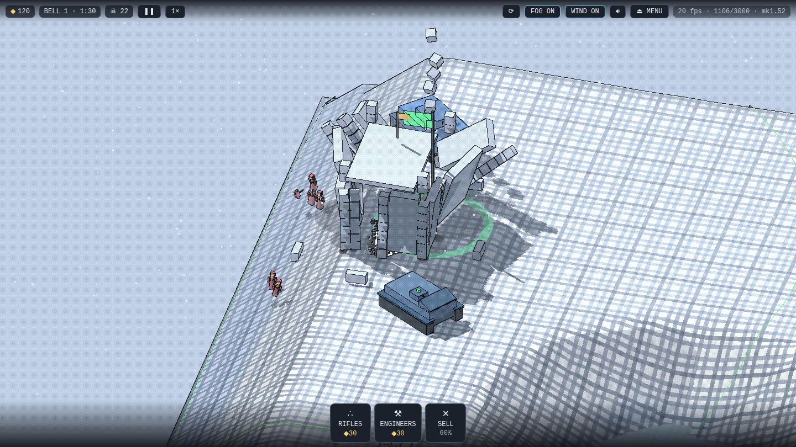
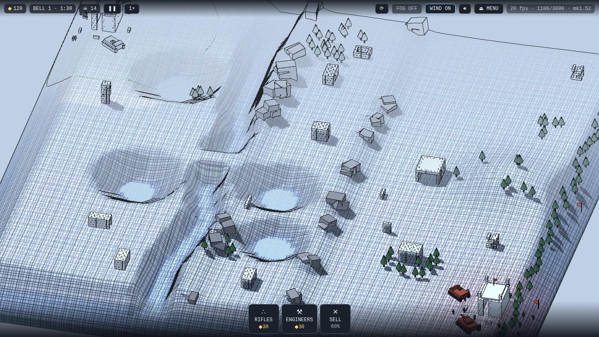

# COLDSNAP — WINTER FRONT

**A full physics war game that fits on a floppy disk.** 💾

The whole thing — the war, the engine, five tech demos, every sound — is one 1.38 MB bundle, about 441 KB over the wire. A 1.44 MB floppy still holds it — with 22 KB to spare.

**PLAY:** https://jeffreycoen.github.io/coldsnap/

| | |
|---|---|
|  |  |

Destruction here is structural, not scripted. Every building is individual stones held together by welds with real break forces — a collapse is the physics finding out, not an animation playing.

- **The physics engine is written from scratch in plain JavaScript.** No game engine, no physics library, no WebAssembly. Three.js pushes the triangles; React draws the menus.
- **Deterministic to the bit.** No hidden randomness anywhere. Same seed, same valley; same actions, same war — provable by hash, and tested that way on every push.
- **Every valley is drawn fresh.** A 180-meter square of hills, forests, towns around their chapels and inns, hamlets at their wells, dead hamlets gone to ruin, roads kept and broken — and two fortress depots pressed into opposite corners. No two wars share ground. `?seed=` replays a specific one.
- **Built, not stamped.** Every building is real masonry on real carpentry — pitched slate roofs on ridge beams, lintels over doors hung ajar, the mill's four sails, the belfry's bell on its yoke — and every beam and plate is a physics body that falls when the walls do.
- **The war opens with a draft.** Seven cards dealt each side, units and plans together — pick five, free, and place your units by hand on your ground; the enemy's commander drafts its own five. No two wars open alike. Armor, when drafted or bought, drives like the rest: order it like a squad or take the controls; riders seal into the hold and share the hull's fate.
- **Placement is honest.** Arming any build, hire, or hull paints the whole field's verdict — green where that unit may stand, red where it may not, judged by that unit's own laws: held ground, slope it can park on, room it fits this instant. A footprint-true ghost and a confirm stand between every tap and every coin spent.
- **The menu is the quartermaster's stores.** BUILD opens drawn wireframe crates; a crate's lid swings and its stock deals out as paper tags on a price-tier lattice; placing a unit folds the whole desk away. The convoy's hand and the opening draft deal the same paper.
- **No rule protects the attacker's road.** Wall the valley shut if you like — the assault masses on your masonry and cuts its way through. Breaches reopen the march.
- **The ground bites.** Sappers lay mines and tripwires that the other side never sees — minefields are learned by loss, in both directions.
- **Land is income.** Scrap flows by the second in proportion to ground held — one law, one clock, both armies — and every standing building flies the flag of whoever holds its ground. Ruined stone pays nobody and flies nothing — and the enemy fields what its ground earns, so the map is the war economy.
- **The enemy lives under your rules.** Same physics, same shared market, same prices, same purchase pacing, same target law — its riflemen and tanks fight your men, your hulls, and your mech exactly as yours fight theirs — and a commander personality drawn fresh each war decides when their armor rides out. Symmetry is law.
- **Sight is honest.** Walls block sight and never grant it. An enemy no one sees is not drawn at all.
- **Every sound is synthesized.** Zero audio files: gunfire, the bell, the wind — all procedural, tuned against published acoustics. Distant fire arrives late — sound travels at 343 m/s in-game — and echoes off rock and masonry while the snowfield stays dead.
- **A whole war saves as one JSON string.** The map is not saved — it regrows from its seed, and the war's scars are laid back over it. Lose your depot and the save burns. No rewinds.
- **60 fps on a Raspberry Pi.** The game was built, measured, and played on the machine it targets.
- **A sandbox rides the menu.** A developer's test bench: a fresh random valley on every entry, every weapon free, every enemy kind placed by tap, and a live switch for whether they fight back. Nothing in it is ever saved.
- **The game teaches itself in play.** No manual: twenty-eight one-card lessons fire once each at their first real moment — the first bell, the first radial, the first take-over — pageable and skippable, and holding any control (or its ⓘ) reopens its card. An optional walk tours the essentials before the first war.
- **The front door is the war itself.** The menu's background is the real opening view — the valley about to be played, rendered by the game's own renderer from the seed shown as FIELD ORDER #. Resuming shows the saved war's own valley.

The war itself: every 90 seconds the muster bell rings and the convoy deals a five-card hand — plans that open your build bar, hires that field at once; buy what the till can stand. Both armies buy from one living market where every price is a census of what already stands on the field. Every confirmed kill pays the killing side and scores its ledger — both counts live on the top bar, and the end card carries the match report. Only engineers build, and only with their hands at the wall. Any squad, tower, or hull can be taken over and driven directly while the front fights on — a crimson laser reticle projects each weapon's true landing bound onto the ground, walls, and rooftops the rounds will actually strike — and the guns earn that bound honestly: tank guns, mortars, and rockets fit propellant charge and barrel angle together for the tightest lawful arc, so a short lob is fired weakly and lands tight. Tank and tower barrels visibly rise and fall to clear cover, rooftops your units can see are ground the reticle can stand on, and a unit under your direct control fires wherever you point it — its own driver, handed back the gun, is blind past its sight lines again. Grenadiers throw real grenades that bounce, roll, and burst on a two-second fuse. Every ordered unit shows its route as a green thread on the snow. Dead men stain the snow for the whole war.

## Under the hood

- **Engine** (`src/engine/core.js`, ~2,500 dependency-free lines): sequential-impulse rigid-body solver — boxes, quaternions, friction, stacking — with welds that carry break forces, sleeping bodies, and a fixed 120 Hz timestep.
- **Two-tier collision books**: sleeping and immovable stones file into the broadphase once and stay filed — a cell of settled masonry does no pair work. Measured on the Pi: idle simulation 5.0 → 3.1 ms, assault plus collapse 10.8 → 7.3 ms, physics bit-identical before and after.
- **Determinism culture**: every random draw is seeded and draw-count-stable (a lint gate forbids `Math.random` in game logic); the original demo is byte-frozen and `scripts/golden.mjs` re-extracts the engine from it on every push, asserting bit-identical world-state hashes; behavior laws are asserted over freshly drawn random maps on every run — no chosen seeds, no pinned battles. 2,089 headless checks run green behind seven CI gates on every push.
- **Renderers**: the war draws through its own engine (`src/graphics/renderer.js`, reached only via `src/depot/api.js`); the demos and tower defense keep the original (`src/render/renderer.js`). Each is one Three.js scene, instanced pools with fixed caps sized by measurement — 7,000 stones, 800 trees — and a fog pass that draws only what a living eye can see.
- **The save**: bodies, welds mid-break, craters, squad rosters, minefields, the dice — serialized at each bell into a single JSON string in browser storage.
- Winter Front was built on five playable tech demos — driving, contracts, a campaign, a tower defense, and a walking biped mech — all still on the site behind THE PROVING RANGE.

## Development

```
npm install
npm run dev      # local dev server
npm run build    # static build in dist/
```

Pushes to `main` deploy to GitHub Pages automatically.

**Credits:** Direction & design — Jeff Coen. Code — Claude (Anthropic's
Fable 5), written across many sessions under Jeff's direction. MIT licensed;
copyright held by Jeff Coen.
